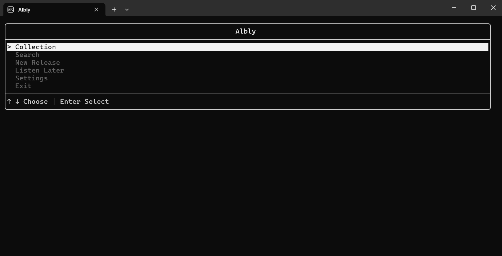
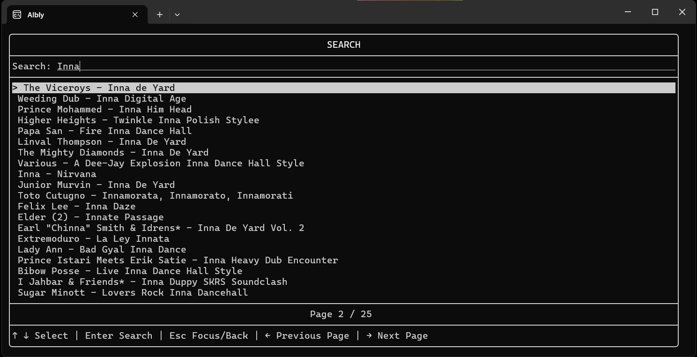

# Albly CLI
A terminal-based music album application written in C++.

Albly CLI connects to the **Discogs API** and allows users to search for music albums directly from the terminal. 
The project is designed as a CLI counterpart to my main [Albly](https://github.com/m4ykey/Albly) application.

## Tech Stack
- [FTXUI](https://github.com/ArthurSonzogni/FTXUI)
- [nlohmann/json](https://github.com/nlohmann/json)
- [cpp-httplib](https://github.com/yhirose/cpp-httplib)

## Screenshots
|  |  |
|:--------------------------:|:----------------------------:|

## Project Setup
1. Clone repository and open in the latest version of your code editor
2. Create ```config.properties``` file
3. Add your [Discogs](https://www.discogs.com/developers) key:
```
DISCOGS_API_KEY=YOUR_DISCOGS_KEY
```

## Project Status
Albly CLI is an ongoing project. More features will be added over time, including album details, collection management and saving to database.

# License
```
Copyright (C) 2025 Michał F

This program is free software: you can redistribute it and/or modify
it under the terms of the GNU General Public License as published by
the Free Software Foundation, either version 3 of the License, or
(at your option) any later version.

This program is distributed in the hope that it will be useful,
but WITHOUT ANY WARRANTY; without even the implied warranty of
MERCHANTABILITY or FITNESS FOR A PARTICULAR PURPOSE.  See the
GNU General Public License for more details.

You should have received a copy of the GNU General Public License
along with this program.  If not, see <https://www.gnu.org/licenses/>.
```